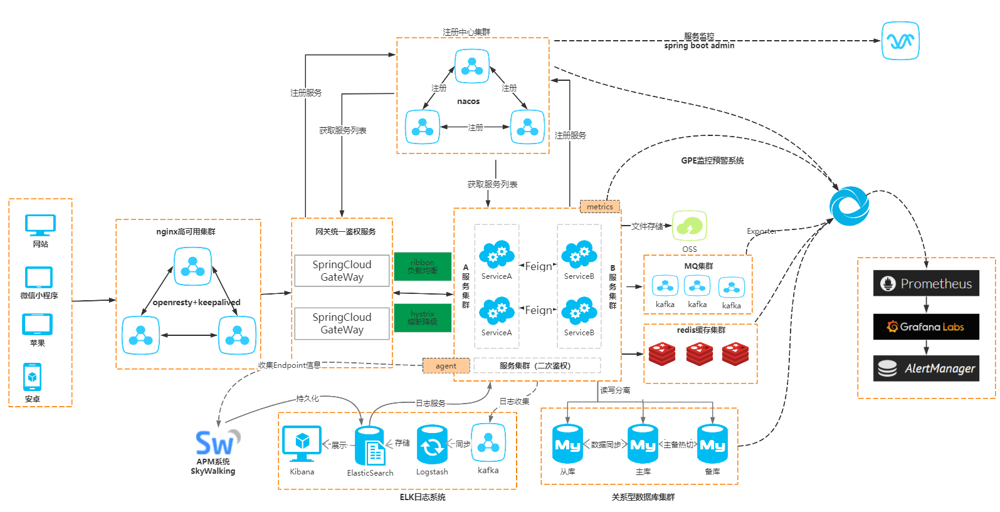
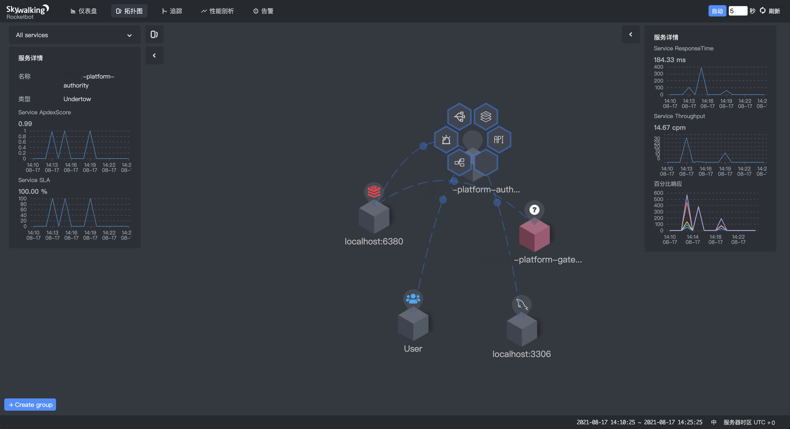
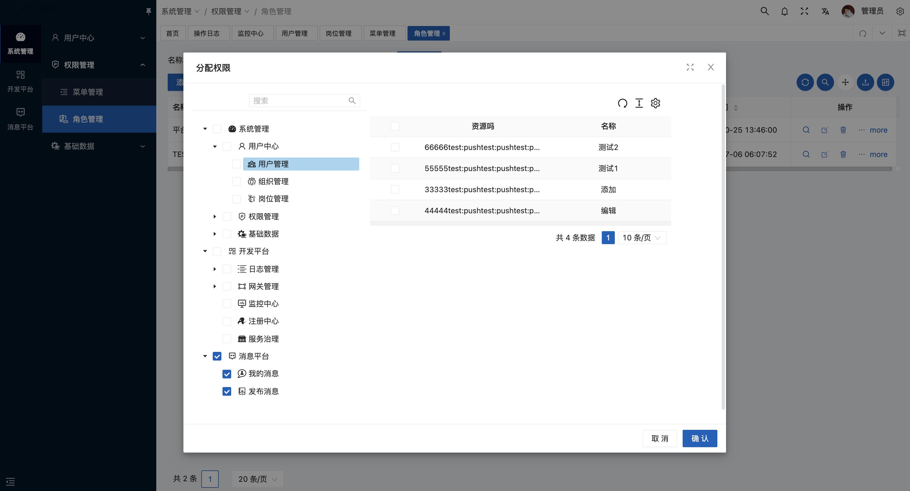
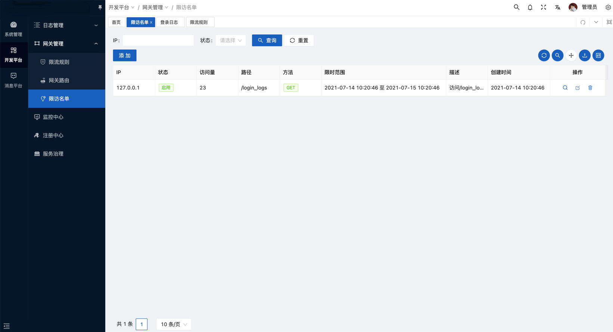
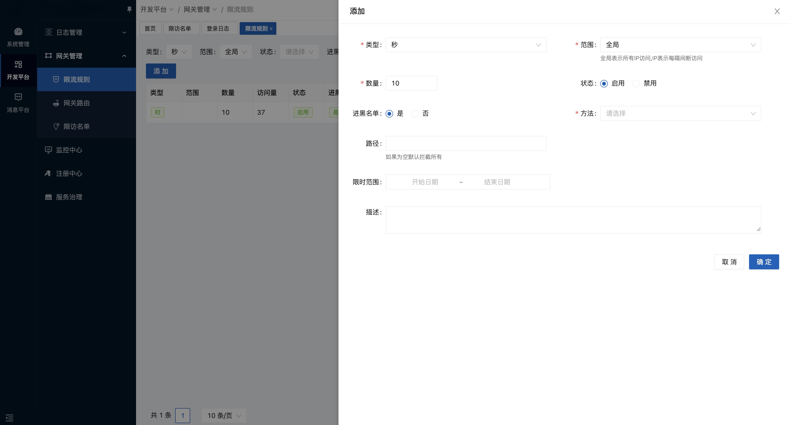
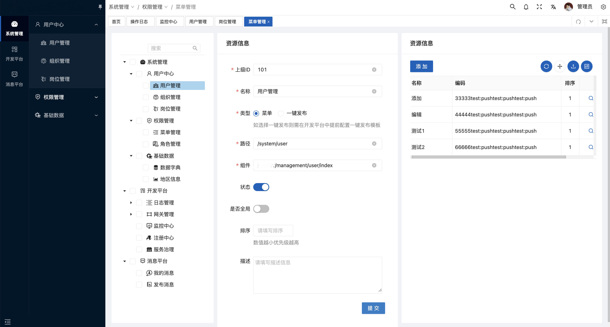
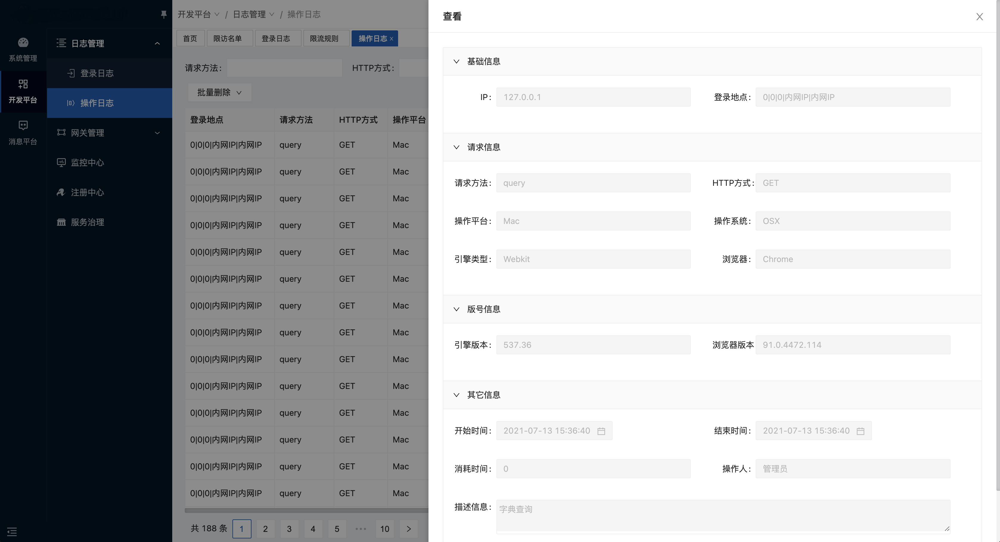
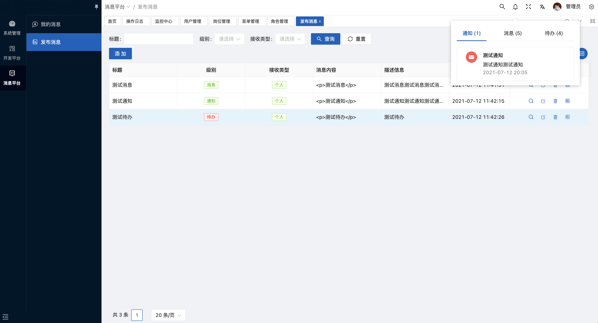
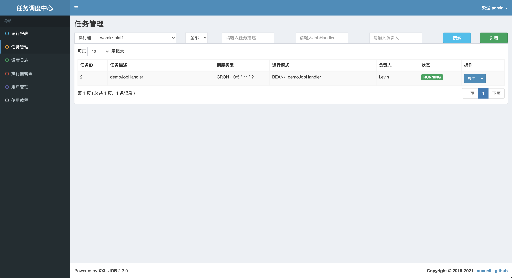
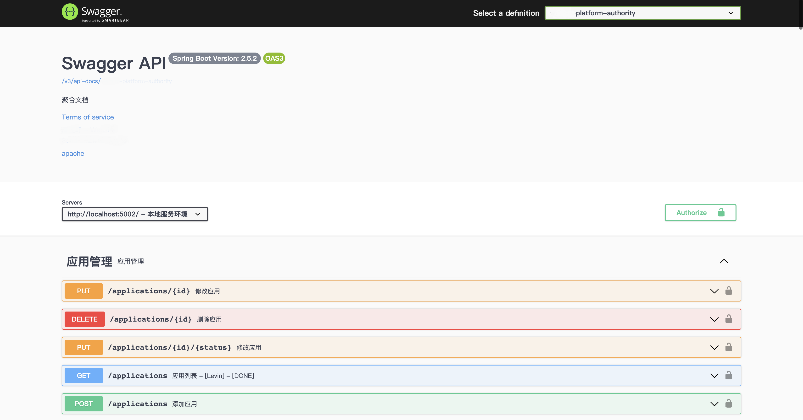

# southern-cloud-admin

 

     

## 介绍

我们想打造一个开源里面UI最好、最容易上手的、中台 、SAAS 、 多租户功能、最最少的代码实现功能的开发框架，青春于蓝胜于蓝，长江后浪推前浪，加油，程序媛们，希望你们超越前人，做出更优秀的作品！如有交流或有项目合作意向，可加QQ：172874793。

## 演示地址

[演示地址](https://cloud.southern-cihui.com/) 

> 平台账号 0000 账号 admin 密码 admin

> 租户账号 1111 账号 admin 密码 admin

## 软件架构

> 技术交流Q群： 869292399

Vue、Spring Cloud Alibaba 2.2.5.RELEASE、Spring Cloud Hoxton.SR11、Nacos、Sentinel、
Nepxion、Mybatis-Plus、多租户、灰度、Oauth2.0、Spring Security、Redis、Mysql、MongoDB、
ShardingJdbc、ShardingSphere

<table>
	<tr>
		<td></td>
    </tr>
	
</table>
### 特点

- 链路追踪：支持 `skywalking`、`zikpin`、`pinpoint` 等多种链路追踪（案例采用 `skywalking`）
- 布局优雅：简洁、多套主题以及导览模式任意组合搭配
- 功能齐全：SAAS/多租户/RBAC权限控制全都具备，下载代码开箱即用
- 消息推送：内置基于WebSocket、Redis实现的分布式消息
- 服务治理：整合 `Nepxion` 框架可以快速实现蓝绿/灰度/服务治理 等强大功能
- 动态网关：支持页面配置(`Redis`)与 `Nacos` 两种推送方式、动态开启关闭网关路由
- 网关管理：支持流量控制、拉黑名单等
- 消息总线：使用 `RabbitMq` 做总线用于支持`动态数据`源消息广播
- 插拔组件：除去必要工程，可选的都在 `options` 按需使用
- 大道至简：代码优雅、简短、不管是开发前端还是后端,快就完事了，下面给出一个简单的示例
- 性能高效：集成链路追踪在2M网络环境下接口最慢不超过 `300毫秒` 普遍 `10-150 毫秒` 之间
- 标准文档：集成标准的 `SpringDoc => Swagger V3` 功能更强大,UI更优美
- 分布式任务：整合 `xxl-job` 提供分布式调度任务功能
- 工作流：集成 `camunda-bpm` 工作流（已提供工作流案例）

## 效果图

## 操作说明

[文档地址](https://www.yuque.com/books/share/c5467c7b-ae67-4d3e-a6cd-541ce5a90bb7@@@?#《southern-cloud-admin-doc》) 

[配套前端](https://gitee.com/southern-cihui/southern-cloud-admin-ui) 配套的 UI 

[Nepxion-Discovery](https://github.com/southern-cihui/southern-cloud-admin) 蓝绿、灰度、流量保护

[OpenAPi3](https://springdoc.org/) Swagger 标准版

### 拓展阅读

[Oauth2.0](https://www.ruanyifeng.com/blog/2019/04/github-oauth.html) OAuth2.0 知识点

`southern-cloud-admin-bury` 是一个用 `shardingsphere` 做分表分库收集日志的，常见埋点日志手段
- **`记录日志文件,EFK/ELK采集日志`**
- **`日志量小的话可以写到库`**
- **`日志量大可以分表分库记录埋点日志，定期清理`**

### 注意事项

**下载项目后请先本地 `mvn install southern-cloud-admin-dependencies` 和 `mvn install southern-cloud-admin-framework`**

**如果需要使用低码平台，需要安装 MongoDB 的支持**

感谢各位开源创作者，感谢他们奉献开源代码，得以大家能互相学习，互相提高，希望越来越多的开源爱好者贡献更多更好的源码，虽然我们与西方国家开源科技还是有一定差距，但只要我们努力、热爱、互助，相信我们完全也可以优秀于他们，加油！

